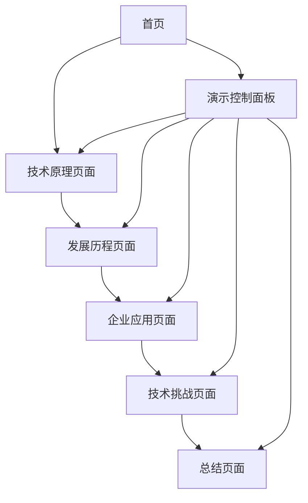

# Text2SQL技术演示网站产品需求文档

## 1. 产品概述

本产品是一个基于Web的Text2SQL技术演示网站，旨在通过图文结合的方式展示Text2SQL技术的全面调研报告内容。网站设计用于支持20-30分钟的技术演讲，为演讲者提供清晰、专业的内容展示平台，帮助听众深入理解Text2SQL技术的原理、发展历程和企业级应用。

## 2. 核心功能

### 2.1 用户角色

| 角色 | 使用方式 | 核心权限 |
|------|----------|----------|
| 演讲者 | 直接访问网站 | 可浏览所有内容、控制演示进度、使用演讲模式 |
| 听众 | 扫码或链接访问 | 可浏览所有内容、查看详细信息 |

### 2.2 功能模块

我们的Text2SQL演示网站包含以下主要页面：

1. **首页**：技术概览、导航菜单、演示控制面板
2. **技术原理页面**：核心技术架构图、实现机制详解、交互式流程图
3. **发展历程页面**：技术演进时间线、里程碑事件、对比分析
4. **企业应用页面**：应用场景展示、案例分析、效果对比
5. **技术挑战页面**：当前挑战、解决方案、未来展望
6. **总结页面**：核心要点回顾、技术价值总结

### 2.3 页面详情

| 页面名称 | 模块名称 | 功能描述 |
|----------|----------|----------|
| 首页 | 技术概览区 | 展示Text2SQL核心价值、技术定义、应用场景概述 |
| 首页 | 导航菜单 | 提供清晰的页面导航、演示进度指示器 |
| 首页 | 演示控制面板 | 支持全屏模式、自动播放、手动切换页面 |
| 技术原理页面 | 架构图展示 | 交互式技术架构图、分层展示、动画效果 |
| 技术原理页面 | 流程详解 | 自然语言理解、SQL生成、结果处理流程图 |
| 技术原理页面 | 代码示例 | 关键技术点的代码演示、实时高亮 |
| 发展历程页面 | 时间线展示 | 从规则系统到大模型的发展历程、关键节点 |
| 发展历程页面 | 技术对比 | 不同时代技术特点对比表、性能提升图表 |
| 企业应用页面 | 场景展示 | 数据分析、商业智能、决策支持等应用场景 |
| 企业应用页面 | 案例分析 | 具体企业应用案例、效果数据展示 |
| 技术挑战页面 | 挑战分析 | 当前技术难点、局限性分析 |
| 技术挑战页面 | 解决方案 | 最新研究进展、改进方法 |
| 总结页面 | 要点回顾 | 核心技术点总结、关键信息提炼 |
| 总结页面 | 价值展望 | 技术发展趋势、应用前景分析 |

## 3. 核心流程

**演讲者操作流程：**
演讲者进入网站首页 → 选择演示模式 → 按顺序浏览各技术模块 → 使用交互功能展示重点内容 → 回答听众问题时快速定位相关页面 → 总结页面结束演示

**听众参与流程：**
听众扫码进入网站 → 跟随演讲进度浏览内容 → 查看详细技术信息 → 在问答环节独立浏览感兴趣的模块

## 4. 用户界面设计

### 4.1 设计风格

- **主色调**：深蓝色(#1e3a8a)作为主色，浅蓝色(#3b82f6)作为辅助色，体现技术专业性
- **按钮风格**：现代扁平化设计，圆角矩形，悬停时有渐变效果
- **字体**：标题使用思源黑体，正文使用系统默认字体，代码使用等宽字体
- **布局风格**：卡片式布局，左侧导航，主内容区域宽敞，支持响应式设计
- **图标风格**：使用线性图标，简洁现代，与整体设计风格一致

### 4.2 页面设计概览

| 页面名称 | 模块名称 | UI元素 |
|----------|----------|--------|
| 首页 | 技术概览区 | 大标题、核心价值描述、背景渐变、动画效果 |
| 首页 | 导航菜单 | 侧边栏导航、进度指示器、图标+文字组合 |
| 技术原理页面 | 架构图展示 | SVG交互图表、分层动画、点击展开详情 |
| 发展历程页面 | 时间线展示 | 垂直时间线、里程碑节点、悬停显示详情 |
| 企业应用页面 | 场景展示 | 卡片网格布局、图标+描述、数据可视化图表 |
| 技术挑战页面 | 挑战分析 | 问题列表、解决方案对比表、进度条显示 |
| 总结页面 | 要点回顾 | 关键点列表、统计数据展示、行动建议 |

### 4.3 响应式设计

网站采用桌面优先的响应式设计，在大屏幕上提供最佳的演示体验，同时适配平板和手机设备，确保听众可以在不同设备上流畅浏览内容。支持触摸操作优化，方便移动设备用户交互。