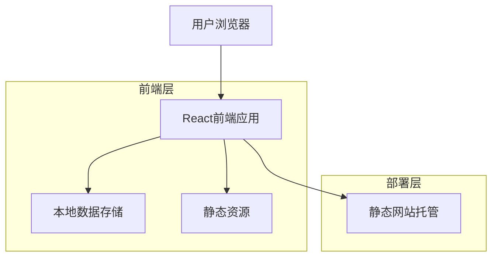
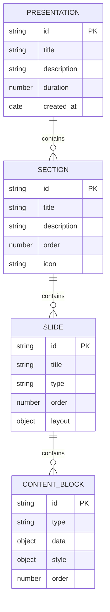
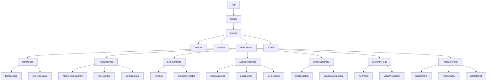

# Text2SQL演示网站技术架构文档

## 1. 架构设计



## 2. 技术描述

* 前端：React\@18 + TypeScript + Tailwind CSS + Vite

* 图表库：D3.js + Chart.js

* 动画库：Framer Motion

* 图标库：Lucide React

* 部署：静态网站托管（Vercel/Netlify）

## 3. 路由定义

| 路由            | 用途                   |
| ------------- | -------------------- |
| /             | 首页，展示Text2SQL技术概览和导航 |
| /principles   | 技术原理页面，展示核心技术架构和实现机制 |
| /evolution    | 发展历程页面，展示技术演进时间线     |
| /applications | 企业应用页面，展示应用场景和案例分析   |
| /challenges   | 技术挑战页面，展示当前挑战和解决方案   |
| /summary      | 总结页面，展示核心要点和技术价值     |
| /presenter    | 演讲者控制面板，提供演示控制功能     |

## 4. 数据模型

### 4.1 数据模型定义



### 4.2 数据结构定义

**演示内容数据结构**

```typescript
// 演示文稿接口
interface Presentation {
  id: string;
  title: string;
  description: string;
  duration: number; // 分钟
  sections: Section[];
  createdAt: Date;
}

// 章节接口
interface Section {
  id: string;
  title: string;
  description: string;
  order: number;
  icon: string;
  slides: Slide[];
  estimatedTime: number; // 分钟
}

// 幻灯片接口
interface Slide {
  id: string;
  title: string;
  type: 'overview' | 'technical' | 'timeline' | 'application' | 'challenge' | 'summary';
  order: number;
  layout: {
    type: 'single' | 'split' | 'grid' | 'timeline';
    columns?: number;
  };
  contentBlocks: ContentBlock[];
}

// 内容块接口
interface ContentBlock {
  id: string;
  type: 'text' | 'image' | 'chart' | 'code' | 'diagram' | 'list' | 'quote';
  order: number;
  data: {
    content?: string;
    imageUrl?: string;
    chartData?: ChartData;
    codeSnippet?: CodeSnippet;
    listItems?: string[];
  };
  style: {
    width?: string;
    height?: string;
    alignment?: 'left' | 'center' | 'right';
    animation?: AnimationConfig;
  };
}

// 图表数据接口
interface ChartData {
  type: 'line' | 'bar' | 'pie' | 'timeline' | 'flowchart';
  data: any[];
  options: {
    title?: string;
    xAxis?: string;
    yAxis?: string;
    colors?: string[];
  };
}

// 代码片段接口
interface CodeSnippet {
  language: string;
  code: string;
  highlights?: number[];
  explanation?: string;
}

// 动画配置接口
interface AnimationConfig {
  type: 'fadeIn' | 'slideIn' | 'zoomIn' | 'typewriter';
  duration: number;
  delay?: number;
  trigger: 'onLoad' | 'onScroll' | 'onClick';
}

// 演讲者控制接口
interface PresenterControl {
  currentSlide: number;
  isPresenting: boolean;
  isFullscreen: boolean;
  autoAdvance: boolean;
  autoAdvanceInterval: number; // 秒
  notes: string;
}
```

**技术内容数据结构**

```typescript
// Text2SQL技术概念接口
interface Text2SQLConcept {
  id: string;
  name: string;
  description: string;
  category: 'principle' | 'technology' | 'application' | 'challenge';
  importance: 'high' | 'medium' | 'low';
  relatedConcepts: string[];
}

// 技术发展历程接口
interface TechnologyEvolution {
  id: string;
  period: string;
  title: string;
  description: string;
  keyFeatures: string[];
  limitations: string[];
  representativeWorks: string[];
  year: number;
}

// 企业应用案例接口
interface ApplicationCase {
  id: string;
  companyName: string;
  industry: string;
  useCase: string;
  description: string;
  benefits: string[];
  metrics: {
    name: string;
    value: string;
    improvement: string;
  }[];
  technologies: string[];
}

// 技术挑战接口
interface TechnicalChallenge {
  id: string;
  title: string;
  description: string;
  category: 'accuracy' | 'performance' | 'scalability' | 'usability';
  severity: 'critical' | 'major' | 'minor';
  currentSolutions: string[];
  futureDirections: string[];
}
```

## 5. 组件架构



## 6. 性能优化策略

### 6.1 代码分割

* 按路由进行代码分割，减少初始加载时间

* 懒加载图表和动画组件

* 预加载关键资源

### 6.2 资源优化

* 图片压缩和WebP格式支持

* SVG图标优化

* 字体子集化

### 6.3 缓存策略

* 静态资源长期缓存

* 演示数据本地存储

* Service Worker离线支持

## 7. 部署配置

### 7.1 构建配置

```json
{
  "build": {
    "outDir": "dist",
    "sourcemap": false,
    "minify": true,
    "target": "es2015"
  },
  "optimizeDeps": {
    "include": ["react", "react-dom", "d3", "chart.js"]
  }
}
```

### 7.2 环境变量

```env
VITE_APP_TITLE=Text2SQL技术演示
VITE_APP_VERSION=1.0.0
VITE_APP_DESCRIPTION=Text2SQL技术全面解析演示网站
```

### 7.3 部署脚本

```bash
# 构建生产版本
npm run build

# 部署到静态托管平台
npm run deploy

# 本地预览
npm run preview
```

